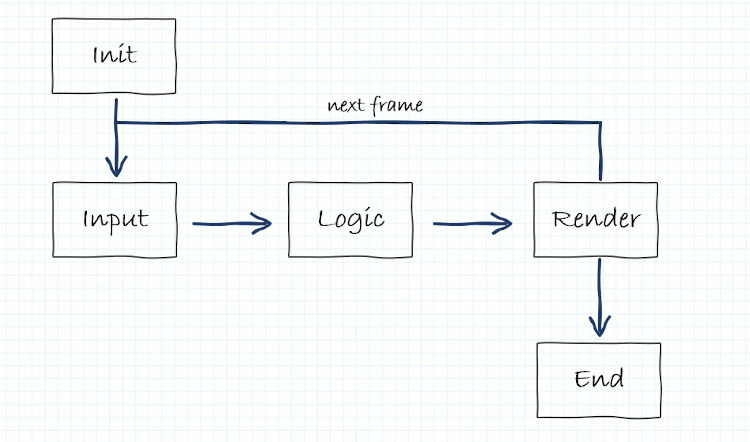

# Estructura de un juego

Cada vez que ejecutamos un videojuego, dentro del ordenador se están ejecutando muchos procesos de forma secuencial y ordenados. Aunque a simple vista parece que cada elemento funcione de forma independiente y con vida propia, en realidad los procesos internos están ejecutandose y coordinandose entre sí, dentro de un bucle que se ejecuta una y otra vez.

## Gameloop

Aunque existen muchas variantes del ciclo de vida de un juego, podríamos visualizar de forma muy resumida y básica como el siguiente esquema:

 

En cada iteración del bucle, el motor de juego debe leer los controles de entrada, ejecutar la lógica del juego, dibujar la pantalla y vuelta a empezar. 

El número de veces por segundo que se ejecuta dicho bucle es lo que llamamos FPS (frames per second), que significa el número de veces que el juego pinta la pantalla y por tanto, suponemos que actualiza la lógica del juego. A mayor número de FPS más fluido se verá el juego. Por contra a menor número de FPS más a trompicones se verá el juego. 

El nivel aceptable de FPS suele oscilar en torno a los 60 FPS, aunque es posible una buena experiencia de juego con un ratio incluso por debajo de los 30 FPS.

En un mundo idílico, este bucle se ejecutaría de forma constante y continua a lo largo del tiempo y en todas las plataformas donde se ejecute, y el número de FPS sería altísimo. Pero en la realidad esto no es así debido a la diversidad de procesadores y la complejidad de algunos cálculos, por lo que el motor de juego debe realizar un control sobre cada iteración del bucle.

Aquí es donde entran en juego dos pequeñas utilidades que suelen utilizar los motores de juego para realizar el control de FPS.

### Sleep time

Si elegimos un objetivo de FPS para nuestro juego, el motor de juego al terminar la iteración en curso, podría calcular cuanto le ha llevado ejecutar la iteración completa y esperar una determinada cantidad de milisegundos para conseguir 'frenar' la ejecución de FPS. Por ejemplo, si nuestro objetivo es llegar a una tasa de 60 FPS, necesitamos ejecutar cada iteración del bucle en 1000 / 60 ms, unos 16,6 ms. Si el motor termina una iteración y detecta que ha tardado menos tiempo, manda a dormir al proceso hasta que se cumplan esos 16,6 ms.

De esta forma, obtendremos una ejecución más o menos homogénea de cada iteración del juego.

Además, si el procesador está muy saturado ejecutando cálculos y el motor de juego detecta un desvío muy grande en el tiempo de ejecución de esos 16,6 ms, el motor es capaz de 'saltarse' frames de forma puntual. Esto hará que la tasa de FPS sea un dato que oscile alrededor de 60 FPS, pero que no siempre será igual.

!!! info "Consejo"
    Para nuestra tranquilidad, de esto se encarga el motor de juego mediante la configuración inicial, por lo que no debemos preocuparnos demasiado.

### Delta time

Para evitar que el salto de FPS afecte a la lógica del juego y el jugador perciba ese cambio de velocidad de ejecución, es necesario que los cálculos estén siempre basados en un delta time, o incremento de tiempo.

Volvamos al ejemplo de antes, donde la tasa de refresco era de 60 FPS y por tanto 16,6 ms en cada iteración. Si queremos que un personaje se desplace en la pantalla a razón de 100 pixels por segundo, lo lógico es hacer que en cada iteración se desplace unos 1,6 pixels. Al cabo de las 60 iteraciones, se habrá desplazado 100 pixels. 

¿Pero que pasaría si en el segundo número 3, el motor de juego decidiera saltarse frames para liberar procesamiento y en lugar de ejecutar 60 frames en un segundo, ejecutara 55 frames? Con este escenario tendríamos que nuestro personaje se habría desplazado 100 pixels en primer segundo, otros 100 pixels el segundo y 88 pixels el tercero. El usuario percibiría que el personaje a veces va rápido y otras veces va lento.

Para evitar esto, el cálculo de desplazamiento no debería estar basado en la tasa de FPS, sino en el deltaTime, el tiempo que el procesador ha gastado en la última iteración. En nuestro ejemplo, el delta time debería ser 16,6 ms en cada iteración, salvo cuando el procesador se salte algún frame, que en ese caso el delta time será mayor a 16,6 ms ya que contendrá el incremento de tiempo que el procesador no pudo gastar.

Si queremos que nuestro personaje se mueva 100 pixels en 1 segundo, eso significa que deberemos moverlo 0,1 pixels cada 1 milisegundo. En las iteraciones 'buenas', desplazaremos el personaje 0,1 * 16,6 = 1,6 pixels, pero en los tiempos de saturación es posible que nuestro delta time sea por ejemplo 24 ms y tengamos que desplazar el personaje 0,1 * 24 = 2,4 pixels. 

Esto hará que nuestro personaje de pequeños saltos imperceptibles a la vista humana (suelen ser del orden de uno o dos pixels), pero conseguiremos que en el cómputo global de 1 segundo, se habrá desplazado exactamente 100 pixels, y el jugador no percibirá cambios de ritmo en el personaje.

!!! info "Consejo"
    Para nuestra tranquilidad, de esto se encarga el motor de juego y nos calcula e informa del deltaTime que debemos utilizar en cada iteración. Nosotros tan solo debemos preocuparnos de realizar los cálculos basados siempre en este deltaTime.

## Input

## Visualización

## Sonido

## Comunicaciones
