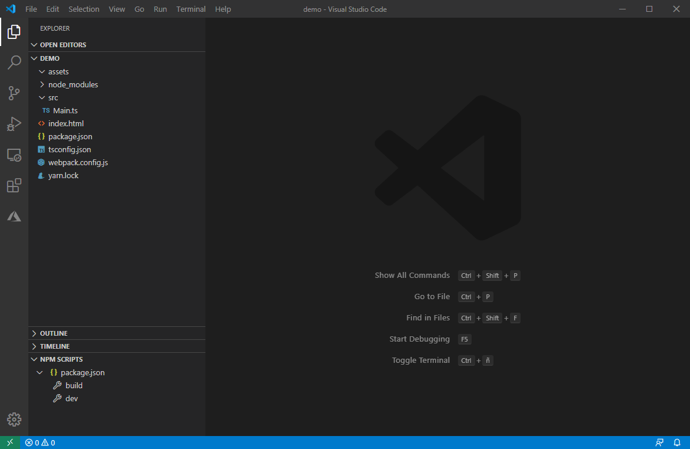
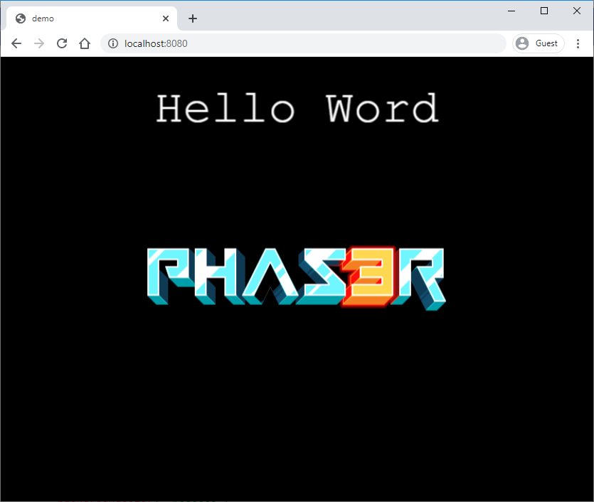

# Empezando con Phaser 3

Phaser es un entorno de programación que tiene como objetivo ayudar a crear juegos de forma rápida en HTML5. Fue creado específicamente para aprovechar los beneficios de los navegadores modernos, tanto de escritorio como móviles. El único requisito del navegador es el soporte de canvas.

Incluye una amplia y detallada documentación, características y ejemplos para que se pueda avanzar rápidamente en el desarrollo del juego. Es compatible con WebGL y es Open Source.

Podemos acceder a más información y a toda la documentación desde su página web [https://phaser.io/](https://phaser.io/)


## Herramientas

A continuación os mostraré el conjunto de herramientas que vamos a ir utilizando a lo largo del tutorial. 

### Visual Studio Code

Podemos utilizar cualquier IDE de desarrollo que tenga soporte para TypeScript. En mi caso Visual Studio Code es la herramienta que utilizaré. Se puede instalar desde su página web [https://code.visualstudio.com/](https://code.visualstudio.com/).

### Node

También necesitamos node y npm para poder crear, compilar y ejecutar el proyecto generado en TypeScript. Si fueramos a trabajar directamente con javascript no sería necesario, pero al tratarse de TypeScript necesitaremos compilar el proyecto.
Se puede instalar desde su página web [https://nodejs.org/](https://nodejs.org/)

Comprueba que tienes instalada esta herramienta ejecutando en consola el comando ``` node --version ``` y ``` npm --version ```

### Yarn

Es la herramienta que utilizaremos para gestionar las dependencias de librerías del proyecto. Se podría utilizar directamente npm, pero hemos decidido elegir la opción de yarn por ser un poco más cómodo de utilizar. Se puede instalar desde su página web [https://yarnpkg.com/](https://yarnpkg.com/).

Comprueba que tienes instalada esta herramienta ejecutando en consola el comando ``` yarn --version ```


## Creación de proyecto

Ahora que ya tenemos todas las herramientas necesarias instaladas, vamos a crear el proyecto para nuestro juego. Podemos crear el proyecto de cero paso a paso, o bien descargarnos una plantilla con todos los pasos configurados.

### Creación mediante plantilla

Lo más rápido es acceder a la plantilla rápida que he creado en el repositorio [https://github.com/dummysoft/template_phaser3](https://github.com/dummysoft/template_phaser3) donde podréis hacer un fork o descargar el proyecto en zip. Lo descomprimís en el directorio que queráis y ya tenéis el proyecto listo para ser abierto con el IDE. 

!!! success "Creado"
    Si has creado el proyecto mediante una plantilla, puedes saltarte los siguientes pasos de creación manual, dependencias y configuración, hasta el siguiente punto de "Hello World"


### Creación manual del proyecto

Lo primero será crear el directorio donde desarrollaremos nuestro juego. Una vez tenemos la carpeta creada, debemos inicializar el proyecto con el comando ``` yarn init ``` dentro de la carpeta del juego. Nos irá lanzando preguntas como el nombre del proyecto, la versión y la descripción. Esto creará un fichero ``` package.json ``` que contiene la información del proyecto.

### Añadir dependencias

A continuación se deben añadir las dependencias que vamos a utilizar en nuestro proyecto. Para ello vamos a ejecutar los siguientes comandos
``` bash
yarn add --dev copy-webpack-plugin ts-loader typescript webpack webpack-cli webpack-dev-server 
``` 
``` bash
yarn add phaser 
```
El primer comando añadirá las dependencias necesarias para configurar y ejecutar un proyecto web, y el segundo comando añadirá la dependencia con la librería de Phaser. 
Al no poner ninguna versión, se descargará siempre la última versión disponible de cada una de las librerías, lo que puede provocar que el resto del tutorial no funcione. Este tutorial lo he realizado con las siguientes versiones 

``` json
"devDependencies": {
    "copy-webpack-plugin": "6.0.1",
    "ts-loader": "7.0.5",
    "typescript": "3.9.3",
    "webpack": "4.43.0",
    "webpack-cli": "3.3.11",
    "webpack-dev-server": "3.11.0"
},
"dependencies": {
    "phaser": "3.23.0"
}
```

Si alguna no coincide y queréis modificarla, se puede editar el fichero ``` package.json ```. Recordad que si modificáis el fichero de dependencias, tendréis que refrescarlas utilizando el comando ``` yarn ```


### Configurar webpack

El siguiente paso será configurar el plugin webpack para poder ejecutar un servidor web en local que nos sirva los recursos web. Para ello tendremos que crear un fichero llamado ``` webpack.config.js ``` que deberá tener el siguiente contenido. También os podéis descargar el contenido del fichero desde el siguiente enlace a Github que os dejo a continuación [https://github.com/dummysoft/template_phaser3/blob/master/webpack.config.js](https://github.com/dummysoft/template_phaser3/blob/master/webpack.config.js)

``` javascript
const path = require('path');
const webpack = require('webpack');
const CopyPlugin = require('copy-webpack-plugin');

module.exports = {
  entry: {
    app: './src/Main.ts',
    vendors: ['phaser']
  },

  module: {
    rules: [
      {
        test: /\.tsx?$/,
        use: 'ts-loader',
        exclude: /node_modules/
      }
    ]
  },

  devtool: 'inline-source-map',

  resolve: {
    extensions: [ '.ts', '.tsx', '.js' ]
  },

  output: {
    filename: 'app.bundle.js',
    path: path.resolve(__dirname, 'dist')
  },

  mode: 'development',

  devServer: {
    contentBase: path.resolve(__dirname, 'dist'),
    https: false,
    host: '0.0.0.0',
    port: 8080,
    disableHostCheck: true,
  },

  plugins: [
    new CopyPlugin({
      patterns: [
        { from: path.resolve(__dirname, 'index.html'), 
            to: path.resolve(__dirname, 'dist')  },
        { from: 'assets', to: 'assets', noErrorOnMissing: true},
      ],
    }),
    new webpack.DefinePlugin({
      'typeof CANVAS_RENDERER': JSON.stringify(true),
      'typeof WEBGL_RENDERER': JSON.stringify(true)
    }),
  ],

  optimization: {
    splitChunks: {
      cacheGroups: {
        commons: {
          test: /[\\/]node_modules[\\/]/,
          name: 'vendors',
          chunks: 'all'
        }
      }
    }
  }
};
```

Básicamente con este fichero le estamos diciendo que módulos/librerías debe incluir en el compilado, como debe compilar y que directorios debe incluir y donde debe copiar todos los recursos. Además, también tenemos una sección donde configuraremos el servidor de desarrollo que se ejecutará en local, puerto, permisos y protocolo http o https.

Si queréis indagar más en el formato de este fichero podéis visitar la web del plugin [https://webpack.js.org/](https://webpack.js.org/) donde encontraréis más información.

### Configurar TypeScript

El último paso para configurar el entorno es definir como debe compilar TypeScript. Para ello, creamos un fichero con nombre ``` tsconfig.json ``` donde pegaremos el siguiente contenido.

``` json 
{
    "compilerOptions": {
      "target": "es5",
      "sourceMap": true
    },
    "include": [
      "**/*.ts"
    ]
}
```

En este fichero se indica donde está el código fuente y cual es la versión de TypeScript que vamos a utilizar en el proyecto.


### Añadir scripts para ejecución

Para terminar la configuración, debemos crear los scripts de código, y antes de eso debemos crear dos directorios dentro de la carpeta del juego:

*   ```assets``` que es donde alojaremos los recursos del juego
*   ```src``` que es donde alojaremos el código TypeScript del juego

Dentro de la carpeta ```src``` crearemos un fichero ```Main.ts``` donde escribiremos la rutina principal del juego. Por ahora vamos a copiar el siguiente contenido y más adelante ya explicaré el código.

``` typescript
import * as Phaser from 'phaser';

const gameConfig: Phaser.Types.Core.GameConfig = {
  title: 'demo',
 
  type: Phaser.AUTO,
  
  scale: {
    mode: Phaser.Scale.FIT,
    autoCenter: Phaser.Scale.CENTER_HORIZONTALLY,
    width: 800,
    height: 600,
    parent: 'content'
  },
 
  backgroundColor: '#000000',
  scene:  [],
};
 
const Game = new Phaser.Game(gameConfig);
```

También crearemos un fichero ```index.html``` donde pondremos la página inicial de nuestro juego. Por ahora copiaremos el siguiente contenido.

``` html
<!DOCTYPE html>
<html lang="en">
  <head>
    <meta charset="UTF-8">
    <title>demo</title>
    <meta name="viewport" 
        content="width=device-width, initial-scale=1, user-scalable=no">
    <meta name="HandheldFriendly" content="True">
    <meta name="MobileOptimized" content="320">
    <meta http-equiv="cleartype" content="on">
    <style>
      html,
      body {
        margin: 0 !important;
        padding: 0 !important;
        overflow: hidden !important;
      }
    </style>
  </head>
  <body>
    <div id="content" style="height: 100vh;"></div>
    <script src="vendors.app.bundle.js"></script>
    <script src="app.bundle.js"></script>
  </body>
</html>
```

Por último, vamos a crear dos scripts sencillos para poder lanzar el proyecto mediante un comando sencillo. Para ello editamos el fichero ``` package.json ``` y le añadimos al final un bloque de scripts.

``` json
{
    ...
    "scripts": { 
        "build": "webpack", 
        "dev": "webpack-dev-server" 
    }
}
```

Con esto nos aseguramos que ejecutando el comando ``` yarn build ``` compilará nuestro código fuente para generar la distribución de nuestro juego, y ejecutando el comando ``` yarn dev ``` compilará el código y levantará un servidor web local en el puerto 8080, donde podrémos acceder e ir probando nuestro juego.


!!! success "Creado"
    A partir de este punto ya tienes el proyecto creado y configurado de forma manual. Ya puedes pasar al siguiente punto de "Hello World"

## Hello Word

### Estructura de proyecto

Una vez creado el proyecto, vamos a desarrollar nuestro primer HelloWorld. Pero antes vamos a echar un ojo a la estructura del proyecto que tenemos creado. Tanto si has descargado el template desde Github como si has seguido los pasos manuales, deberías tener la siguiente estructura de proyecto

 

Los información más relevante de esta estructura es la siguiente:

*   ```package.json``` contiene la configuración del proyecto y los scripts de generación
*   ```tsconfig.son``` contiene la configuración de TypeScript
*   ```webpack.config.js``` contiene la configuración del servidor web local
*   ```assets``` contiene los recursos del juego (imágenes, música, datos)
*   ```src``` contiene el código fuente del juego
    *   ```Main.ts``` es la clase principal que se ejecutará nada más abrir el juego


### Creamos una nueva Scene

!!! attention "Ojo"
    En este ejemplo no comentaré muy en profundidad el código fuente, simplemente quiero que sea un ejemplo de crear un juego en el que aparezca algo en pantalla. En las siguientes secciones de este tutorial ya explicaré más a fondo el significado de cada clase y objeto.

Para esta pequeña demo de "HelloWorld" vamos a mostrar un texto en la pantalla y una imagen estática. Lo primero que debemos hacer es crear una nueva clase ```HelloWorldScene.ts``` donde codificaremos el funcionamiento de nuestra pantalla o escena. El fichero debe contener lo siguiente:

``` typescript
const sceneConfig: Phaser.Types.Scenes.SettingsConfig = {
    key: 'scene-helloworld',
};

export class HelloWorldScene extends Phaser.Scene {

    constructor() {
        super(sceneConfig);
    }

    public preload() {
        this.load.image('logo', 'http://labs.phaser.io/assets/sprites/phaser3-logo.png');
    }

    public create() {
        this.add.text(this.cameras.main.centerX, 70, 'Hello Word').setOrigin(0.5, 0.5).setFontSize(64);
        this.add.sprite(this.cameras.main.centerX, this.cameras.main.centerY, 'logo');
    }

}
```

### Añadimos Scene al Game

Y ahora, añadiremos esta escena al juego principal. Abrimos el fichero ```Main.ts``` y en la propiedad ```scene``` añadimos la clase que acabamos de crear:

``` typescript hl_lines="16"
...
const gameConfig: Phaser.Types.Core.GameConfig = {
  title: 'demo',
 
  type: Phaser.AUTO,
  
  scale: {
    mode: Phaser.Scale.FIT,
    autoCenter: Phaser.Scale.CENTER_HORIZONTALLY,
    width: 800,
    height: 600,
    parent: 'content'
  },
 
  backgroundColor: '#000000',
  scene:  [HelloWorldScene],
};
...
```

Si ahora ejecutamos el juego en el navegador, veremos una pantalla con un texto en la parte superior y una imagen centrada en la pantalla.

 
